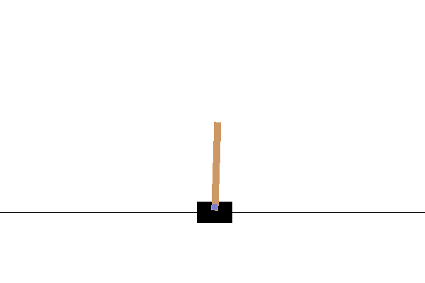

# Deep Q-learning

여기서는 Q-learning 에 기반한 알고리즘들을 다루고, 이러한 알고리즘들을 통합적으로 적용하여 성능을 개선한 Rainbow 까지 살펴본다.

## DQN

Mnih, Volodymyr, et al. "Human-level control through deep reinforcement learning." Nature 518.7540 (2015): 529.

- Key idea: Q-learning with deep learning + experience replay + freeze target network

DQN 은 Q-learning 에 function approximator 로 deep learning 을 사용한 버전이다. 딥마인드가 Atari 게임을 풀면서 유명해졌다. Q-learning 에서 Q-function 을 업데이트하는 Loss function 을 다음과 같이 사용한다:

$$
L(\theta)=\left( y-Q_\theta(s,a) \right)^2
$$

그리고 이 때의 target y 는:

$$
y=r + \gamma\max_{a'}Q_\theta(s',a')
$$

다. 이것만으로 잘 되면 좋겠지만 그렇지가 않아서 여기에 몇 가지 트릭을 추가로 사용한다.

**Trick 1: Experience replay.** RL 에서 데이터는 에이전트가 실제로 움직이면서 얻어내기 때문에, 자연스럽게 데이터 간 correlation 이 심하게 발생한다. 이 문제를 해결하기 위해 experience replay memory 라고 불리는 커다란 데이터 버퍼를 만들고, 다량의 데이터를 쌓아두고 여기서 랜덤하게 샘플링하여 학습에 사용한다. 이는 Q-learning 이 off-policy method 이기 때문에 가능한 방법이다.

**Trick 2: Freeze target network.** 보통의 supervised learning 과는 다르게, Q-learning 은 parametrized target 을 사용하기 때문에 네트워크를 업데이트 할 때마다 동일한 input 에 대해서도 target 값이 계속 바뀌어서 학습이 불안정해진다. DQN 에서는 학습을 안정화시키기 위해 target 값을 계산하는 Q-network 의 weight 를 고정시키고 일정 주기마다 한번씩 업데이트 해 주는 방식을 사용한다.

### [Trained Results]

