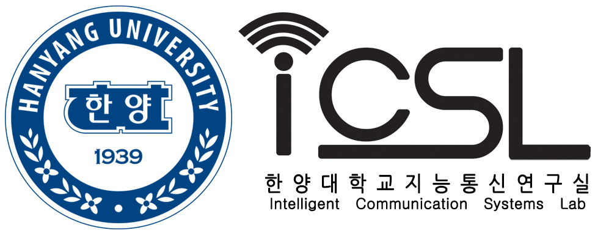
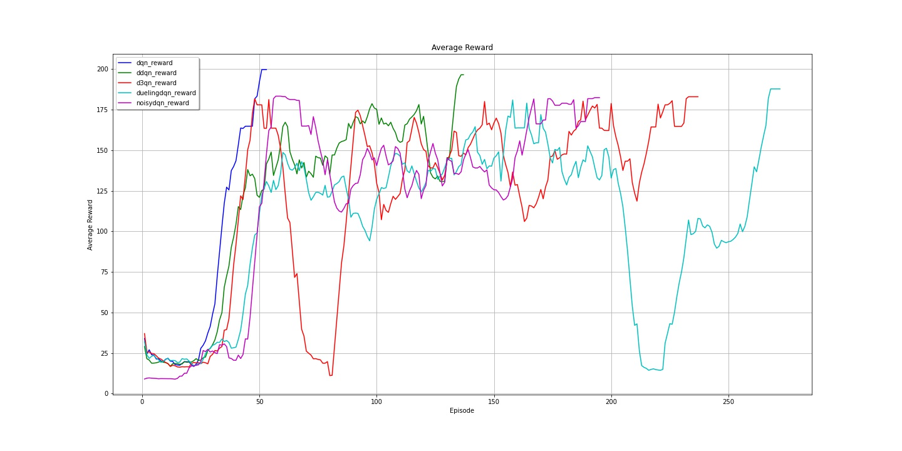
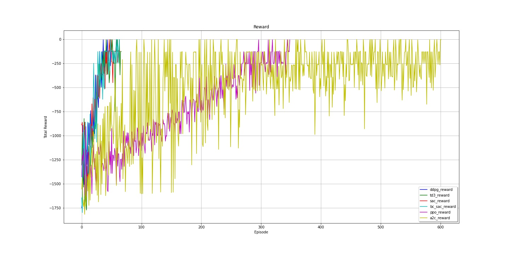

# Code With Deep Reinforcement Learning

<p align="center">

</p>

## Single Agent Algorithm

### Value Based

- [x] Deep Q Network(DQN) (off-policy)
- [x] Double Deep Q Network(Double DQN) (off-policy)
- [x] Dueling Deep Q Network(Dueling DQN) (off-policy)
- [x] Duelling Double Deep Q Network(D3QN) (off-policy)
- [x] Noisy Networks for Exploration(NoisyDQN) (off-policy)

### Actor-Critic Method

- [x] Advantage Actor-Critic(A2C) (on-policy)
- [ ] Asynchronous Advantage Actor-Critic(A3C) (on-policy)
- [x] Proximal Policy Optimization(PPO)(GAE) (on-policy)(Nearing off-policy)
- [ ] Proximal Policy Gradient(PPG) (on-policy PPO + off-policy Critic[Let it share parameters with PPO's Critic])
- [x] Deep Deterministic Policy Gradient(DDPG) (off-policy)
- [x] Twin Delayed Deep Deterministic policy gradient(TD3) (off-policy)
- [x] Soft Actor-Critic(SAC) (off-policy)
- [x] Truncated Quantile Critics(TQC) (off-policy)
- [ ] Distribution Correction(DisCor) based on Soft Actor-Critic(DisCor)
- [x] Randomized Ensembled Double Q-Learning(REDQ)

### Deep reinforcement learning with a latent variable model

- [x] Stochastic Latent Actor-Critic(SLAC)
- [x] SAC with AutoEncoder(SAC_AE)

### Regularizing Deep Reinforcement Learning from Pixels

- [x] Data regularized Q(DrQ-v1)
- [x] Data regularized Q(DrQ-v2)

### Imitation Learning / Inverse Reinforcement Learning

- [x] Behavior Cloning(BC)
- [ ] Generative Adversarial Imitation Learning(GAIL)

### ReplayBuffer Structure

- [x] Prioritized Experience Replay(PER)
- [ ] Hindsight Experience Replay(HER)

### Neural network architecture designed for deep reinforcement learning

- [x] Deep Dense Architectures in reinforcement learning(D2RL)

### Explore

- [ ] Intrinsic Curiosity Module(ICM)

### Distributed Reinforcement Learning

- [x] APEX(resemblance)
- [x] MPI


## Multi Agent Algorithm

### Actor-Critic Method

- [x] Multi Agent Deep Deterministic Policy Gradient(MADDPG)
- [x] MADDPG Method TD3, SAC
- [ ] Multi Agent Proximal Policy Optimization(MAPPO)
- [ ] COMA

### Value Based

- [ ] QMIX


## Installation
- Clone the repo and cd into it:
    ```bash
    git clone https://github.com/namjiwon1023/Code_With_RL
    cd Code_With_RL
    ```
- If you don't have Pytorch installed already, install your favourite flavor of Pytorch. In most cases, you may use
    ```bash
    pip3 install torch torchvision torchaudio -f https://download.pytorch.org/whl/lts/1.8/torch_lts.html # pytorch 1.8.1 LTS CUDA 10.2 version. if you have GPU.
    ```
    or
    ```bash
    pip3 install torch==1.8.1+cpu torchvision==0.9.1+cpu torchaudio==0.8.1 -f https://download.pytorch.org/whl/lts/1.8/torch_lts.html # pytorch 1.8.1 LTS CPU version. if you don`t have GPU.
    ```
    to install Pytorch GPU or CPU version.

## File Structure
+ **Hyperparameter** # Algorithm Hyperparameters
  + dqn.yaml
  + doubledqn.yaml
  + duelingdqn.yaml
  + d3qn.yaml
  + noisydqn.yaml
  + ddpg.yaml
  + td3.yaml
  + sac.yaml
  + ppo.yaml
  + a2c.yaml
  + behaviorcloning.yaml
  + etc.
+ **agent.py**
  + reinforcement learning algorithm
+ **network.py**
  + QNetwork
  + NoisyLinear
  + ActorNetwork
  + CriticNetwork
+ **replaybuffer.py**
  + Simple PPO Rollout Buffer
  + Off-Policy Experience Replay
+ **runner.py**
  + Training loop
  + Evaluator
+ **main.py**
  + Start training
  + Start evaluation
+ **utils.py**
  + Make gif image
  + Drawing
  + Basic tools

## Quick Start

To **train** a new network : run `python main.py --algorithm=selection algorithm`

To **test** a preTrained network : run `python main.py --algorithm=selection algorithm --evaluate=True`

Reinforcement learning **algorithms** that can now be selected:
+ **DQN**
+ **Double_DQN**
+ **Dueling_DQN**
+ **D3QN**
+ **Noisy_DQN**
+ **DDPG**
+ **TD3**
+ **SAC**
+ **PPO**
+ **A2C**
+ **BC_SAC**

Discrete action space recommendation: **Dueling DoubleQN (D3QN)**

Continuous action space recommendation: use **TD3** if you are **good at tuning parameters**, use **PPO** or **SAC** if you are **not good at tuning parameters**, if the training **environment Reward function is written by beginners**, then use **PPO** .

## Training Environment
Discrete action :
<br/>


Continuous action :
<br/>


Multi-Agent Training Environment:
<br/>


## Training Result

Value Based Algorithm Compare Result:

<br/>





<br/>

Policy Based Algorithm Compare Result:

<br/>




## Distributed Reinforcement Learning Structure


## Requirements

```
Python 3.6+ : conda create -n icsl_rl python=3.6
Pytorch 1.6+ : https://pytorch.org/get-started/locally/
Numpy : pip install numpy
openai gym : https://github.com/openai/gym
matplotlib : pip install matplotlib
tensorboard : pip install tensorboard

```

## Citation:
To cite this repository:
```
@misc{algorithms_drl,
  author = {Zhiyuan Nan},
  title = {Code With Deep Reinforcement Learning},
  year = {2021},
  publisher = {Github},
  journal = {GitHub repository},
  howpublished = {\url{https://github.com/namjiwon1023/Code_With_RL}},
}
```

## References

[Key Papers in Deep RL](https://spinningup.openai.com/en/latest/spinningup/keypapers.html#id106)

[PG Travel Guide](https://reinforcement-learning-kr.github.io/2018/06/29/0_pg-travel-guide/)

[utilForever/rl-paper-study](https://github.com/utilForever/rl-paper-study)

[Khanrc's blog](http://khanrc.github.io/)

[CUN-bjy/rl-paper-review](https://github.com/CUN-bjy/rl-paper-review)
